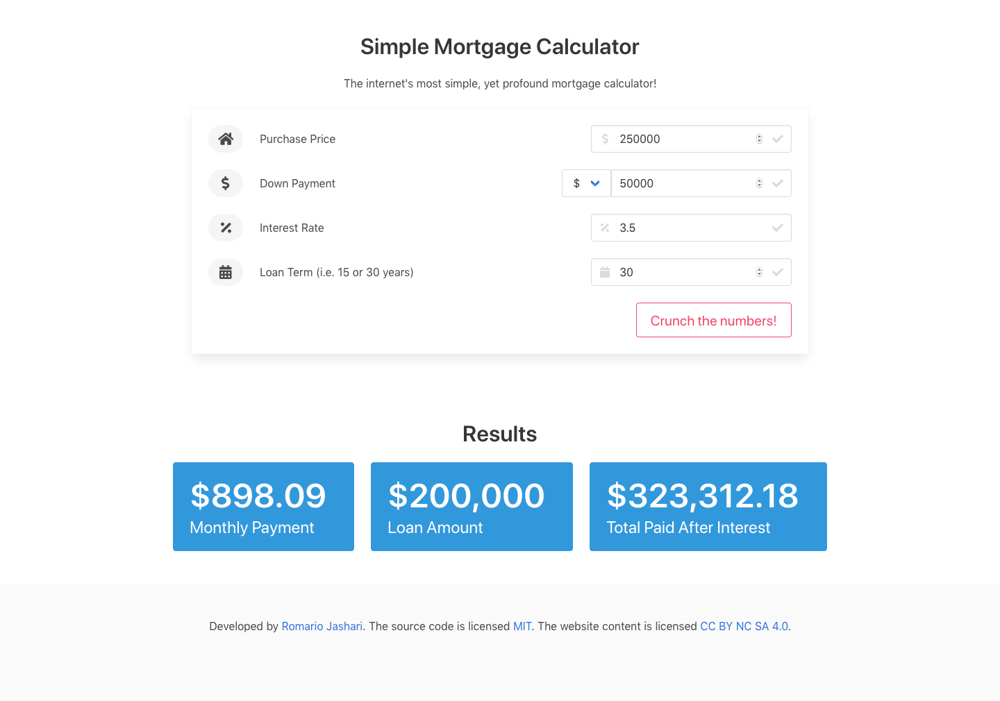

# Mortgage Calculator

Use this calculator as a guide when looking over your mortgage documents to understand the large implications that an interest-rate drop of 0.25% can save you tens of thousands over the entirety of the loan term, or how PMI payments linger for 6 years on average and add up to tens of thousands of dollars. 

<a href="https://romrioo.github.io/mortgagecalculator/" target="_blank">View Live</a>

